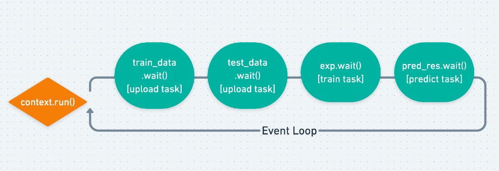
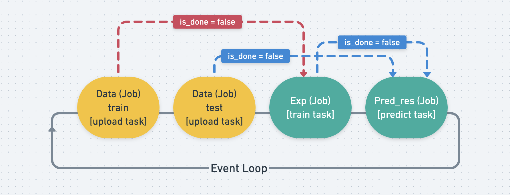
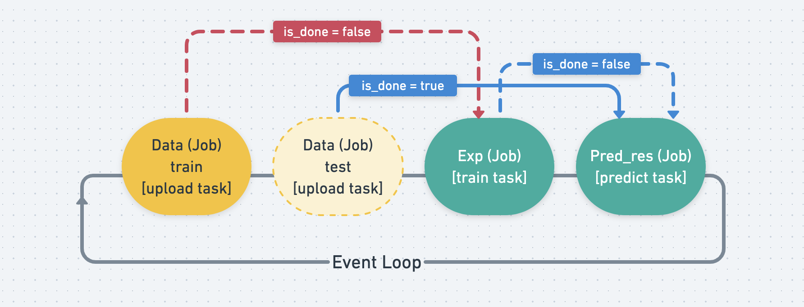
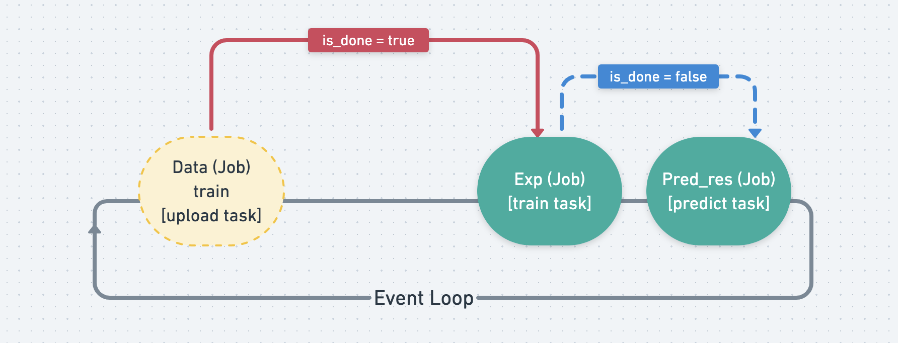
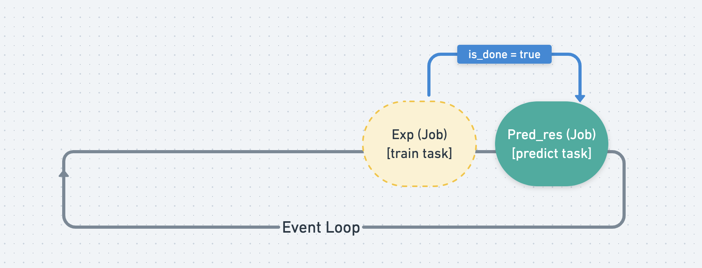
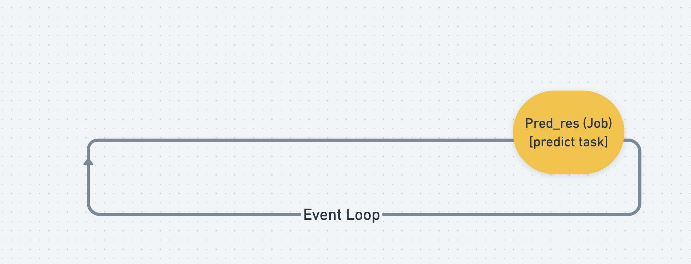

.. _design:

Design Notes
~~~~~~~~~~~~

If you are curious why Decanter AI Core SDK does certain things the way it does and not differently, this section is for you.

Background
**********

Decanter AI
===========
Decanter AI is an AutoML tool, which is able to do feature engineering, auto model training and prediction.

Actions
=======
There are 4 actions that are provided by Decanter AI.

1.  Upload Data: User has to upload the data to Decanter AI that is used for training or predicting.
2.  Setup Data: Change data column type
3.  Train Data: Training models, based on the data upload previously.
4.  Predict Data: Predicting the data with the model which is trained previously.

Design Decisions
****************

When a developer is using Decanter's API, such as using upload api to upload a csv file.
He needs to start the upload by sending the upload request and monitor the status by continuously sending requests and receiving responses from getting task api. It's not that convenient and it'll block other processes while waiting for the task to be done, causing the decanter server to waste its resources, since it can process up to four tasks at a time.

In order to let the user handle tasks more efficiently and intuitively, there are three main goals:

1.  The user needs not be aware of the existence of API.
2.  The user needs not be aware of the task lifecycle.
3.  Non-blocking when running tasks that don't have a dependency relationship.
    (ex. Tasks of uploading train and test data don't depend on each other,
    making them run concurrently and asynchronously saves more time.)

Design Overview
***************

Context Module
==============

`Context` module manages the global eventloop.

Client Module
=============

`Client` module provides main function SDK users, including 4 actions. The user creates the actions with specified parameters, therefore, it will put the task into eventloop list which is managed by `Context`.

CoreAPI Module
==============

`CoreAPI` module is a client of Decanter AI Server. Its responsibility is to communicate with Decanter AI server.

Job and Task Module
===================
We mainly have four actions to do during training models:

-   Upload(`Task`) ⇒ DataUpload(`Job`)
-   Setup ⇒ DataUpload
-   Train ⇒ Experiment
-   Predict ⇒Predict Result

We structure the result we want to get as a `Job` which will store the
properties we wish to get easily. Ｗe let every corresponding action be
a `Task` which will be executed by a `Job` in order to get the result from it.

The relationship between :class:`~decanter.core.jobs.job.Job`
and :class:`~decanter.core.jobs.task.Task`

1.  Each `Job` has a `Task` and the `Job`'s mission is to execute
    the `Task` and wait for it until it's done.
2.  `Job`'s properties (or attributes) is the result of the `Task`.
3.  When every `Job` starts to execute and gets the result from `Task`,
    it needs to wait for all the `Job` in its jobs list to be done.

Ex. `PredictResult <Job>` must wait for `Experiment <Job>`
and `DataUpload <Job>` to be done.

How to do it asynchronously?
~~~~~~~~~~~~~~~~~~~~~~~~~~~~

Why do we need asynchronous functionality? Since the decanter server can actually handle
upto 4 tasks running at once, if we do the job synchronously, we could
only do one task at a  time which is time-wasting.

We address this by using the :doc:`python:library/asyncio-task` in the Python asyncio library
We use ``await`` to handle the blocking problems. According to
`this passage <https://www.aeracode.org/2018/02/19/python-async-simplified/>`_.

"When you call ``await``, the function you're in gets suspended while whatever
you asked to wait on happens, and then when it's finished, the event loop will
wake the function up again and resume it from the await call, passing any
result out."

Therefore, coroutines that involve time-consuming calls such as calling APIs
or waiting for pre-requests `Job` to be done will be blocked and idle, and this
is the condition we can call ``await``. It'll block the currently running
coroutines and put them onto the event loop's list of paused coroutines so something
else can be run.

In `Job` there are two blocking conditions:

1.  Waiting for undone pre-requests jobs: Call ``await asyncio.sleep()`` to
    suspend the current running coroutine and resume after a few seconds. Means
    that ``Job.wait()`` check the jobs status every five seconds.
2.  Calling API: When calling ``self.update()`` the `Task` will fetch the
    result from Decanter AI server, we use ``await`` to wait for the result,
    so it can run other coroutines while waiting for the response.

``Job.wait``:

.. code-block:: python

    # pesudo code of the coroutine Job.wait()
    async def wait(self):
        # check if all the jobs in list is done
        # if haven't call sleep to let other coroutine can be execute
        while not all self.jobs is done:
                await asyncio.sleep(5)

        # if there's jobs failed the coroutine fails to and no need to execute
        if not all self.jobs is success:
                return

        # start to execute task
        self.task.run()

        # keep update task result and Job properties by calling self.update
        # finshed when task is done
        while self.task.not_done():
            await self.update()
            await asyncio.sleep(5)

        # update the status of the Job
        # other jobs that waits for this can know that it's done
        self.status = self.task.status

Structure Flow Overview
~~~~~~~~~~~~~~~~~~~~~~~
When we create the client of CoreClient() ``client = CoreClient()`` we simply
create a `Job`. And its coroutines ``Job.wait()`` will be scheduled to
execute in the event loop.

Notice that the event loop won't start to run until we call
``context.run()`` and each `Job` has its own `Task` waiting to be finished.

But each `Job`'s task has different timing to start, as shown by the picture below.
Ex. exp needs to wait for train data to finish, and pred_res needs to
wait for test data and exp.

When a `Job` is finished, it will set its ``is_done`` tag to true, and
leave the event loop.

Since the `Job` that waits for other `Job` s  will keep monitoring its ``is_done`` tag,
when it finds all of the `Job` s its waiting are done, it will start to run
its own `Task`.

